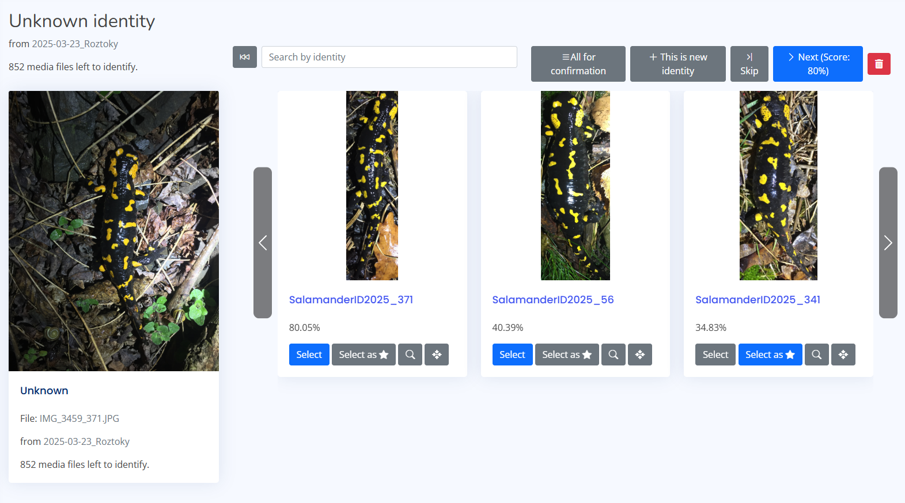

# Individual Identification

The Identification module is the core of the application, allowing you to recognize specific individuals (e.g., "Lynx_01", "Bear_Bastien") across different images and videos using AI-assisted matching.

## 1. Getting Data into Identification

There are two primary ways to feed data into the identification pipeline:

### A. From Taxon Classification
If you have already processed images through the [Taxon Classification](taxon_classification.md) module, you can simply select the relevant species (e.g., *Lynx lynx*) and forward those files directly to the Identification module.

### B. Direct Upload
You can upload data directly if you already have files sorted or if you are importing an existing dataset.

#### Option 1: Unorganized Images/Videos (New Individuals)
If you have a batch of images and don't know who is who, upload a simple ZIP file. You will assign identities manually in the web interface later.


#### Option 2: Pre-sorted Directories (Existing Database)
If you have an existing database organized by folders (where folder name = identity name), upload a ZIP with that exact structure.

**Structure Example:**
```text
upload.zip
├── Bastien/
│   ├── image1.jpg
│   ├── image2.jpg
│   └── video1.mp4
├── Luna/
│   ├── image1.png
│   └── image2.jpg
└── Max/
   ├── video1.webp
   └── video2.mp4
```

#### Option 3: Advanced Metadata Import (CSV/XLSX)
For complex imports including locations, dates, and coordinates, include a `metadata.csv` or `.xlsx` file in the root of your ZIP archive.

**Structure Example:**
```text
upload.zip
 ├── imgs/
 │   ├── im1.jpg
 │   └── im2.jpg
 ├── video1.mp4
 └── metadata.csv
```

**Metadata Format:**

| `original_path` | `predicted_category` | `unique_name` | `locality name` | `latitude` | `longitude` | `datetime`          |
|-----------------|----------------------|---------------|-----------------|------------|-------------|---------------------|
| imgs/im1.jpg    | Lynx lynx            | Bastien       | Pod dubem       | 49.28021   | 13.1819     | 2023-10-01 14:30:00 |
| imgs/im2.jpg    | Lynx lynx            | Luna          | Za kopcem       | 49.27921   | 13.8219     | 2023-10-01 15:00:00 |
| video1.mp4      | Lynx lynx            | Bastien       | Pod dubem       | 49.28031   | 13.1819     | 2023-10-01 16:00:00 |

*   `original_path`: **Required**. Path to file inside the ZIP.
*   `unique_name`: Optional. The ID of the animal (if known).
*   `predicted_category`: Optional. The species (e.g., *Lynx lynx*).

#### Updating Existing Metadata
You can also use the spreadsheet upload to batch-update metadata for files that are already in the system. Use the "Update metadata" option in the upload menu.


---

## 2. The Dashboard

Once data is uploaded, you manage the workflow from the Identification Dashboard.


The dashboard provides an overview of:

*   **Active Tasks:** Images currently being processed by the AI worker.
*   **Review Queue:** Images processed by AI that are waiting for human confirmation.
*   **Identified Stats:** Statistics on identified individuals.

---

## 3. Identification & Review Process

The AI suggests matches, but the final decision is yours. This ensures high data quality.

### Selecting Images for Review

When you click **Confirm Identification**, you are presented with a list of images that have been processed by the identity analysis and have an embedding vector generated.


These images are **sorted by AI confidence** (the system's certainty about its top match). This allows you to prioritize the most certain identifications or focus on the difficult ones first. You can pick any image from this list to begin the matching process.

### The Matching Interface

When you select an image from the list, the **Matching Interface** opens. This is where the side-by-side comparison happens.



The interface is divided into two main parts:
*   **Query Image (Left):** The new, unidentified image.
*   **Candidates (Right):** A ranked list of potential matches already existing in the database.

### How to process a match:

1.  **Analyze the Suggestion:** The system ranks candidates by similarity.
2.  **Visual Comparison:** Compare patterns, scars, or unique features between the Query Image and the Candidates.
3.  **Confirm Identity:**
    *   **Match Found:** If you see the correct individual in the list, click the **Confirm** (or checkmark) button next to that candidate.
    *   **No Match (New Individual):** If the animal is not in the list, select the option to **Create New Identity**. You will be asked to name the new individual.
    *   **Unidentifiable:** If the image is too blurry or ambiguous, you can mark it as "Unidentifiable".

### Post-Identification
Once confirmed, the image is added to that individual's gallery. This improves the AI's ability to recognize that specific animal in future uploads.
