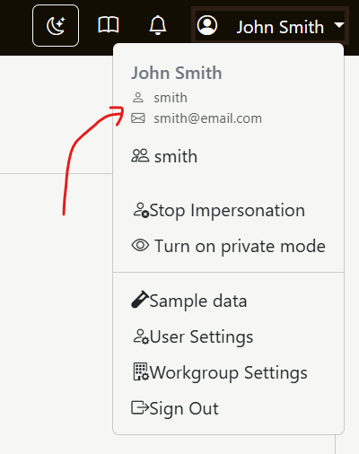
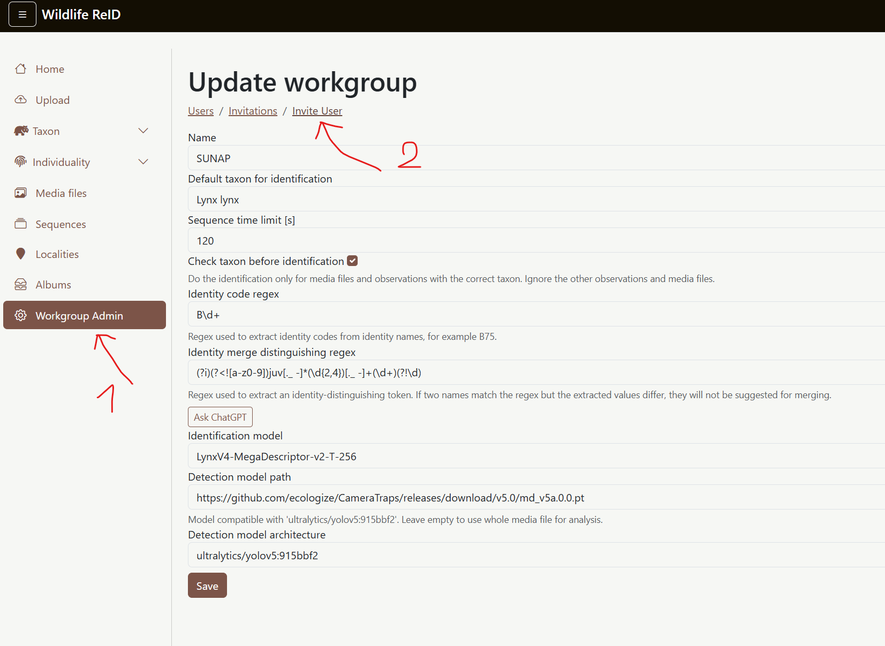
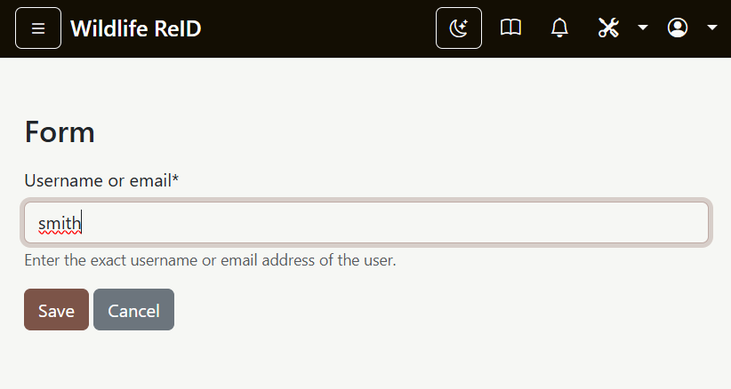
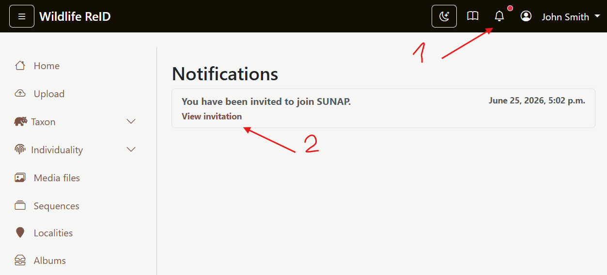
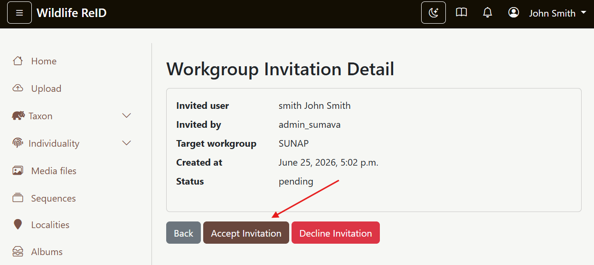
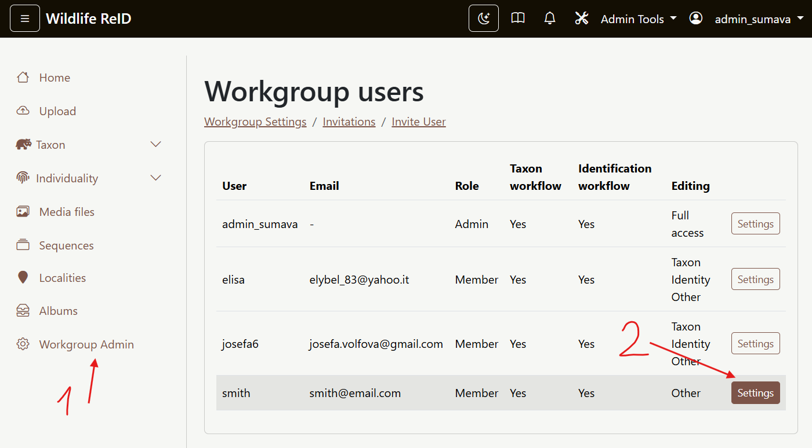
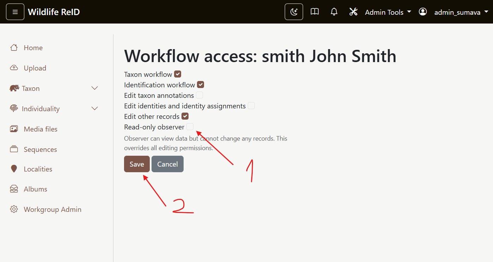

# Workgroup invitations

This guide describes the standard workflow for adding a user to a workgroup:

1. Find the invited user's exact username.
2. Send the invitation from the target workgroup.
3. Let the invited user accept the invitation.
4. Adjust the member's workflow access and editing permissions.

## 1. Find the exact username

The invitation form requires the exact username or email address of the invited user.
Users can find their username in the user menu in the top-right corner.

## 2. Open the invitation form

Workgroup administrators can manage invitations from the workgroup administration area.

1. Open `Workgroup Admin` in the left menu.
2. Open `Invite User`.

## 3. Send the invitation

Enter the invited user's exact username or email address and save the form.

## 4. Accept the invitation

The invited user receives a notification in the application.

1. Open the notification from the bell icon or from the `Invitations` page in the user menu.
2. Open the invitation detail.

In the invitation detail, the user can accept the invitation and move to the target workgroup.

## 5. Set workflow access and permissions

After the user accepts the invitation, the workgroup administrator can open the member list and adjust access.

1. Open `Workgroup Admin`.
2. Find the user in `Workgroup users`.
3. Open `Settings`.

In the settings page, you can enable the taxon workflow, identification workflow, and editing permissions for the new member.

